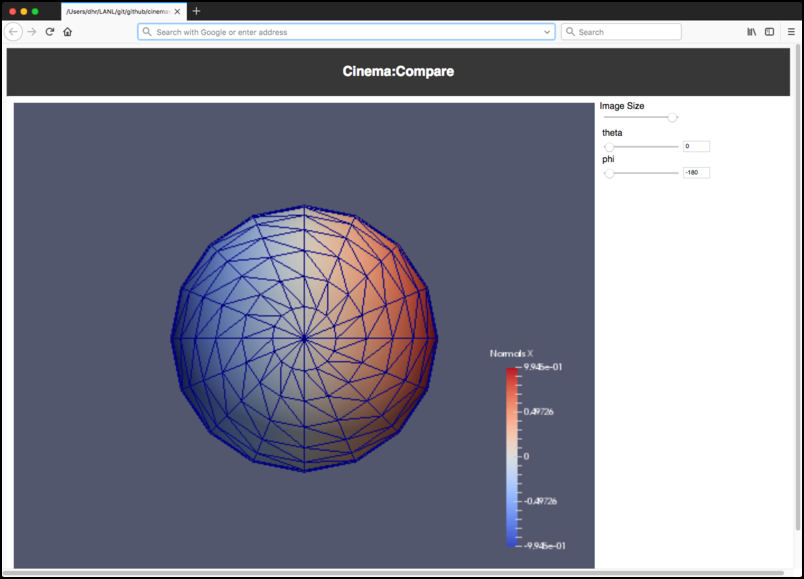

## Cinema:Compare repository 

A simple viewer that compares several Cinema databases.

## Using the viewer

To use the viewer, edit the `index.html` file, and change the value of the array named `dataSets` to include the path to your Cinema Spec D database:


```
    // START: Array of databases to view
    var dataSets = [ "data/sphere.cdb" ];
    // END : Array of databases to view
```   			

Then, view the `index.html` file in the Firefox browser. A single database will be shown like this, with one slider present for every column in the Cinema databse:

<p align="center">

</p>


