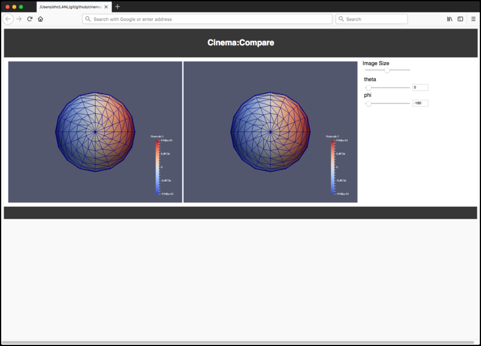

## Cinema:Compare repository, Release v1.0 

A simple viewer that compares several Cinema databases. It can also be used to view a single database, and is easily customizable to include other elements through direct editing of the `html` or `json`.

## Using the viewer

To use the viewer, edit the `index.html` file, and change the value of the array named `dataSets` to include the path to your Cinema Spec D database:


```
    // START: Array of databases to view
    var dataSets = [ "data/sphere.cdb" ];
    // END : Array of databases to view
```   			

Then, view the `index.html` file in the Firefox browser. A single database will be shown like this, with one slider present for every column in the Cinema databse:

<p align="center">
<table>
<tr>
<td></td>
<td></td>
</tr>
<tr>
<td>Screen capture of the viewer with a single database. The UI creates one slider per column in the database.</td>
<td>Screen capture of the viewer with two databases. The UI creates one slide for each column in the databases, assuming both share the same columns. If either database does not have a file for the set of parameters, a blank image is shown.</td>
</tr>

<table>
</p>

## Contact

Contact `cinema-info@lanl.gov` for more information.
